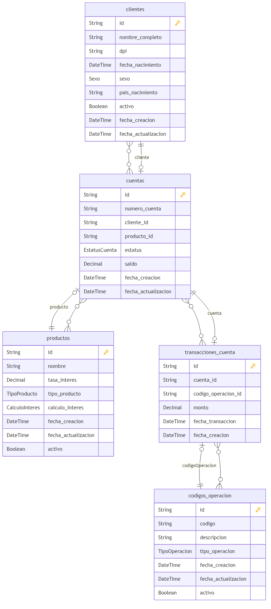

# 🏦 Nexa Banking Challenge

<p align="center">
<a href="https://www.typescriptlang.org/" target="_blank" rel="noreferrer">
    
  </a>
  <a href="https://loopback.io/" target="blank"></a>
  <a href="https://nextjs.org/" target="_blank" rel="noreferrer">
    
  </a>
  <a href="https://reactjs.org/" target="_blank" rel="noreferrer">
    
  </a>
  <a href="https://tailwindcss.com/" target="_blank" rel="noreferrer">
    
  </a>
  <a href="https://zod.dev/" target="_blank" rel="noreferrer">
    
  </a>
  <a href="https://www.docker.com/" target="_blank" rel="noreferrer">
    
  </a>
  <a href="https://www.mysql.com/" target="_blank" rel="noreferrer">
    
  </a>
  <a href="https://www.prisma.io/" target="_blank" rel="noreferrer">
    
  </a>
  <a href="https://nodejs.org/en" target="_blank" rel="noreferrer">
    
  </a>
  <a href="https://www.npmjs.com/" target="_blank" rel="noreferrer">
    
  </a>
  <a href="https://aws.amazon.com/" target="_blank" rel="noreferrer">
    
  </a>
</p>

**Nexa Banking Challenge** es una aplicación bancaria completa desarrollada como una solución full-stack moderna. El proyecto implementa un sistema de banca digital que permite la gestión integral de clientes, cuentas bancarias y transacciones financieras.

### 🎯 Características Principales

- **🔄 TypeScript End-to-End**: Backend y Frontend 100% en TypeScript para tipado seguro
- **🏛️ Backend Robusto**: API REST desarrollada con LoopBack 4 y arquitectura hexagonal para separación de responsabilidades
- **🎨 Frontend Moderno**: Aplicación web responsive con Next.js 15 y React 18
- **🗄️ Base de Datos**: MySQL 8.0 con inicialización automática de datos
- **🐳 Containerización**: Despliegue completo con Docker Compose
- **📊 Dashboard Interactivo**: Visualización de métricas y gráficos en tiempo real
- **🔒 Arquitectura Escalable**: Implementación de patrones CQRS, Repository y Factory

---

## 🎬 Video Explicativo del Proyecto

<p align="center">
  <a href="https://www.youtube.com/watch?v=PLACEHOLDER">
    
  </a>
</p>

<p align="center">
  <em>🎥 En este video se explica la arquitectura, funcionalidades y demostración en vivo de la aplicación bancaria.</em>
</p>

---

## 🚀 Acceso a la Aplicación en Vivo

La aplicación está desplegada y disponible en producción! https://nexa.caribbeandevelopers.space


## ⚡ Inicio Rápido con Docker Compose

### 📋 Prerrequisitos

- **Docker** y **Docker Compose** instalados
- **Git** para clonar el repositorio
- Puerto **3000** (Frontend), **3001** (Backend) y **3306** (MySQL) disponibles

### Levantamiento Completo en 2 Pasos

```bash
# 1️⃣ Clonar el repositorio
git clone <repository-url>

# 2️⃣ Levantar todos los servicios
docker-compose up 
```

### 🌐 URLs de Acceso

Una vez levantados los servicios, podrás acceder a:

| Servicio | URL | Descripción |
|----------|-----|-------------|
| 🎨 **Frontend** | http://localhost:3000 | Aplicación web principal |
| 🔧 **Backend API** | http://localhost:3001 | API REST + Documentación |
| 📖 **API Explorer** | http://localhost:3001/explorer | Documentación interactiva OpenAPI |

### 📊 Datos de Prueba

El sistema se inicializa automáticamente con:
- ✅ **5 clientes** de ejemplo
- ✅ **10 cuentas bancarias** (ahorros y corrientes)
- ✅ **15 transacciones** de prueba
- ✅ **Productos bancarios** predefinidos

---

## 🏗️ Arquitectura del Backend

### 📐 Diagrama de Arquitectura

```
                    ┌─────────────────────────────┐
                    │     PRESENTATION LAYER      |
                    │  ┌─────────────────────┐    │
                    │  │   Controllers REST  │    │
                    │  └─────────────────────┘    │
                    └─────────────────────────────┘
                                    │
                                    ▼
            ┌───────────────────────────────────────────┐
            │          APPLICATION LAYER - CQRS         │
            │  ┌─────────────────┐  ┌─────────────────┐ │
            │  │    Commands     │  │     Queries     │ │
            │  │   (Write Ops)   │  │   (Read Ops)    │ │
            │  └─────────────────┘  └─────────────────┘ │
            └───────────────────────────────────────────┘
                                    │
                                    ▼
    ┌─────────────────────────────────────────────────────────────────┐
    │                           DOMAIN LAYER                          │
    │  ┌─────────────┐  ┌─────────────┐  ┌─────────────────────────┐  │
    │  │  Entities   │  │  Factories  │  │  Repository Interfaces  │  │
    │  │ (Business)  │  │ (Creation)  │  │    (Contracts)          │  │
    │  └─────────────┘  └─────────────┘  └─────────────────────────┘  │
    └─────────────────────────────────────────────────────────────────┘
                                    │
                                    ▼
    ┌─────────────────────────────────────────────────────────────────┐
    │                  INFRASTRUCTURE LAYER                           │
    │  ┌─────────────────────┐    ┌─────────────────────────────────┐ │
    │  │   Repository Impl   │    │     Database Connection         │ │
    │  │   (Data Access)     │    │      (Prisma ORM)               │ │
    │  └─────────────────────┘    └─────────────────────────────────┘ │
    └─────────────────────────────────────────────────────────────────┘
```

### 🎯 Patrones de Diseño Implementados

#### **🔄 CQRS (Command Query Responsibility Segregation)**
- **Commands**: Operaciones de escritura (crear, actualizar, eliminar)
- **Queries**: Operaciones de lectura optimizadas
- **Separación clara** entre lógica de comando y consulta

#### **📚 Repository Pattern**
- **Abstracción** de la capa de datos
- **Interfaces** en el dominio, **implementaciones** en infraestructura
- **Facilita testing** y cambio de tecnologías

#### **🏭 Factory Pattern**
- **Creación controlada** de entidades complejas
- **Validaciones de negocio** centralizadas
- **Encapsulación** de lógica de construcción

---

## 🗄️ Diagrama Entidad-Relación

<p align="center">
  
</p>

### 📊 Estructura de la Base de Datos

El sistema maneja las siguientes entidades principales:

- **👥 Clientes**: Información personal y de contacto
- **🏦 Productos**: Tipos de productos bancarios (Ahorro, Corriente)
- **💳 Cuentas**: Cuentas bancarias asociadas a clientes
- **💸 Transacciones**: Movimientos financieros entre cuentas
- **🔢 Códigos de Operación**: Tipos de transacciones disponibles

---

## 🎨 Frontend: Atomic Design & Arquitectura

### ⚛️ Patrón Atomic Design

El frontend implementa el patrón **Atomic Design**, organizando los componentes en una jerarquía escalable:

```
frontend/app/components/
├── 🔬 atoms/              # Elementos básicos (Button, Input, Icon)
├── 🧬 molecules/          # Combinaciones simples (SearchBox, Card)
├── 🦠 organisms/          # Componentes complejos (Header, DataTable)
├── 📄 templates/          # Layouts de página
└── 🌍 pages/              # Páginas completas
```

### 🏗️ Arquitectura del Frontend

#### **🎯 Tecnologías Principales**
- **⚡ Next.js 15**: Framework React con App Router
- **⚛️ React 18**: Biblioteca de UI con Server Components
- **🎨 Tailwind CSS**: Framework de utilidades CSS
- **🛡️ TypeScript**: Tipado estático para mayor robustez
- **🎭 Shadcn/ui**: Componentes UI accesibles y customizables
- **📊 Recharts**: Gráficos y visualizaciones interactivas

#### **📱 Características de UX/UI**
- **🎨 Design System**: Colores consistentes (#9521B6 púrpura, #011843 azul marino)
- **📱 Responsive Design**: Optimizado para móvil, tablet y desktop
- **♿ Accesibilidad**: Componentes ARIA-compliant
- **⚡ Performance**: Optimización con Next.js y lazy loading
- **🔄 Estado Global**: Gestión eficiente con React hooks

### 🎯 Ventajas del Atomic Design

1. **🔧 Reutilización**: Componentes modulares y reutilizables
2. **🧪 Testing**: Fácil testing unitario de componentes aislados
3. **📚 Documentación**: Estructura clara y autodocumentada
4. **🚀 Escalabilidad**: Fácil mantenimiento y extensión
5. **👥 Colaboración**: Lenguaje común entre diseñadores y desarrolladores

---

## 🛠️ Stack Tecnológico Completo

### 🔧 Backend
- **Framework**: LoopBack 4
- **Lenguaje**: TypeScript
- **Base de Datos**: MySQL 8.0
- **ORM**: Prisma
- **Documentación**: OpenAPI 3.0
- **Testing**: Mocha + Chai

### 🎨 Frontend
- **Framework**: Next.js 15
- **UI Library**: React 18
- **Styling**: Tailwind CSS
- **Components**: Shadcn/ui
- **Charts**: Recharts
- **Validation**: Zod

### 🐳 DevOps & Deployment
- **Containerización**: Docker & Docker Compose
- **Base de Datos**: MySQL 8.0

---

## 👨‍💻 Desarrollado por

**Gerardo Fernández** - Full Stack Developer

---

<p align="center">
  <strong>🏦 Nexa Banking Challenge - Solución Bancaria Moderna</strong>
</p>